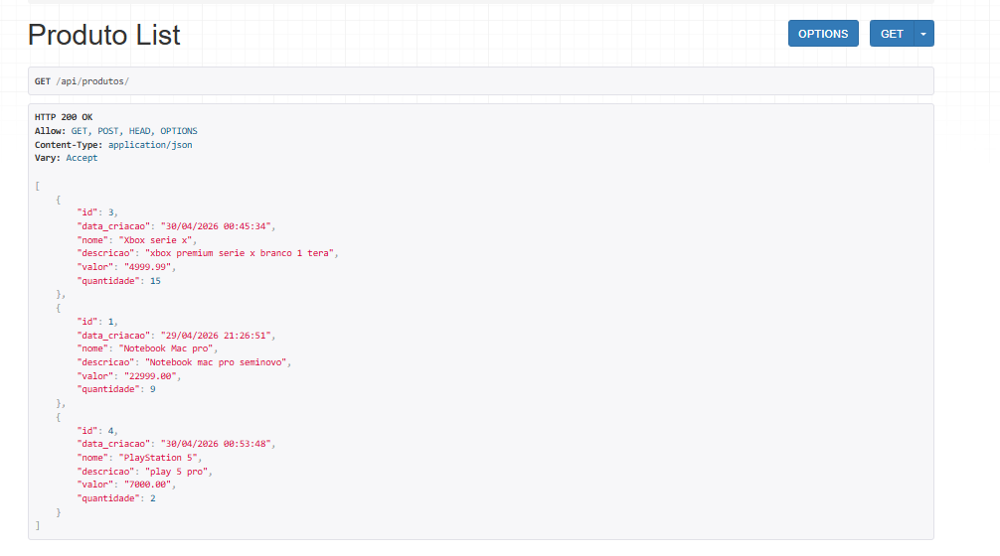
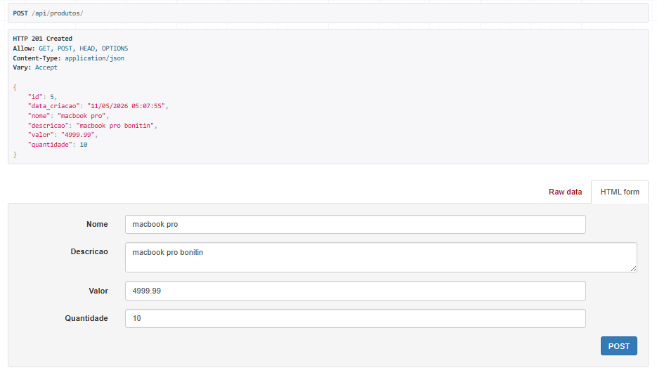
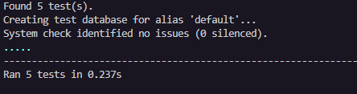

# 🛒 Django REST CRUD — API de Produtos
> Projeto de aprendizado focado em consolidar o uso do **Django REST Framework** e **testes unitários** com uma API CRUD completa.

---

## 📌 Objetivo

Construir uma API REST funcional do zero usando Django, com foco em:

- Estruturar um projeto Django com boas práticas
- Implementar operações CRUD completas com Django REST Framework
- Escrever testes unitários para cada endpoint
- Separar configurações sensíveis com variáveis de ambiente

---

## 🛠️ Stack

| Tecnologia | Uso |
|---|---|
| Python 3.x | Linguagem principal |
| Django 6.x | Framework web |
| Django REST Framework | Construção da API REST |
| PostgreSQL | Banco de dados |
| python-dotenv | Gerenciamento de variáveis de ambiente |
| djangorestframework-simplejwt | autenticaçao jwt nos endpoints|

---

## 📦 Instalação

```bash
# Clone o repositório
git clone https://github.com/Wellington-Roveder/django-produtos-api.git
cd django-produtos-api

# Instale as dependências
pip install -r requirements.txt

# Configure as variáveis de ambiente
cp .env.example .env
# Edite o .env com suas credenciais

# Execute as migrações
python manage.py migrate

# Inicie o servidor
python manage.py runserver
```

---

## ⚙️ Variáveis de ambiente

Crie um arquivo `.env` na raiz baseado no `.env.example`:

```
DB_NAME=
DB_USER=
DB_PASSWORD=
DB_HOST=
DB_PORT=
SECRET_KEY=
DEBUG=
```

---

## 🔗 Endpoints

Base URL: `http://localhost:8000/api/`

| Método | Endpoint | Descrição |
|---|---|---|
| GET | `/produtos/` | Lista todos os produtos |
| POST | `/produtos/` | Cria um novo produto |
| GET | `/produtos/{id}/` | Detalha um produto |
| PUT | `/produtos/{id}/` | Atualiza um produto completo |
| PATCH | `/produtos/{id}/` | Atualiza campos específicos |
| DELETE | `/produtos/{id}/` | Remove um produto |

---
## 🔐 Autenticação JWT

Todos os endpoints exigem autenticação via Bearer Token.

### Obter token

**POST** `/api/token/`

```json
{
    "username": "seu_usuario",
    "password": "sua_senha"
}
```

**Resposta:**
```json
{
    "access": "token_de_acesso",
    "refresh": "token_de_refresh"
}
```

### Usar o token

No header de cada requisição:
```
Authorization: Bearer {access_token}
```

---

## 📋 Exemplo de payload

```json
{
  "nome": "Notebook Gamer",
  "descricao": "Notebook para desenvolvimento",
  "valor": "2999.99",
  "quantidade": 10
}
```

---

## 🖥️ Interface

### GET — Listagem de produtos


### POST — Criação com HTTP 201 Created


---

## 🧪 Testes

```bash
python manage.py test
```

Cobertura de testes implementada:

| Teste | Descrição |
|---|---|
| `test_listar_produtos` | GET retorna status 200 |
| `test_criar_produto` | POST cria e persiste no banco |
| `test_deletar_produto` | DELETE remove e confirma exclusão |
| `test_put_produto` | PUT atualiza produto completo |
| `test_atualizar_produto` | PATCH atualiza campos parciais |

### Resultado dos testes


---

## 🗂️ Estrutura do projeto

```
django-produtos-api/
├── config/
│   ├── settings.py        # Configurações do projeto
│   ├── urls.py            # Roteamento principal
│   └── wsgi.py
├── produtos/
│   ├── models.py          # Model Produto
│   ├── serializers.py     # Serializer com formatação de data
│   ├── views.py           # ViewSet CRUD
│   ├── admin.py           # Registro no admin
│   └── tests.py           # Testes unitários dos endpoints
├── assets/                # Screenshots da interface e testes
├── .env.example
├── .gitignore
├── requirements.txt
└── manage.py
```

---

## 📁 Decisões técnicas

**ModelViewSet**
Uso do `ModelViewSet` do DRF que entrega as 5 operações CRUD com mínimo de código — foco em entender o framework antes de customizar.

**Testes com APITestCase**
Cada operação CRUD tem um teste independente com `setUp` criando um produto base. O banco de testes é isolado e recriado a cada execução.

**Variáveis de ambiente**
`SECRET_KEY`, `DEBUG` e todas as credenciais do banco saem do código e vão para o `.env` — boas práticas desde o primeiro projeto.

**Serializer customizado**
`data_criacao` formatada como `dd/mm/yyyy HH:MM:SS` no serializer com `read_only=True` — campo preenchido automaticamente pelo banco, sem input externo.

**Autenticação JWT**
Uso da biblioteca djangorestframework-simplejwt para restringir o acesso aos endpoints por meio de autenticação JWT. Como a API é stateless, o servidor não precisa armazenar informações de sessão em banco de dados ou memória. O token enviado pelo cliente contém os dados necessários para validação, facilitando o escalonamento horizontal da aplicação.
---

## 🚀 Status

✅ Concluído — API funcional com todos os testes passando.
✅ Projeto concluído
✅ CRUD funcional
✅ Autenticação JWT implementada
✅ Testes unitários passando
✅ Integração com PostgreSQL
✅ Cors implementados
✅ DEPLOY ON RENDER
---

## 👨‍💻 Autor

**Wellington Roveder**
Estudante de Ciência da Computação
[LinkedIn](https://www.linkedin.com/in/wellington-roveder-04637b37b/) · [GitHub](https://github.com/Wellington-Roveder)
